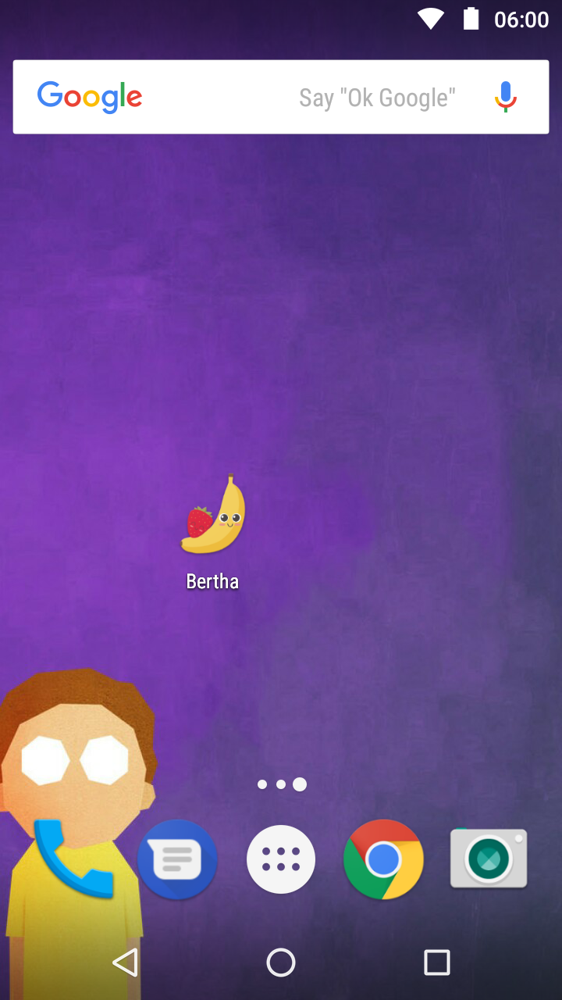
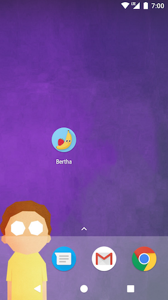
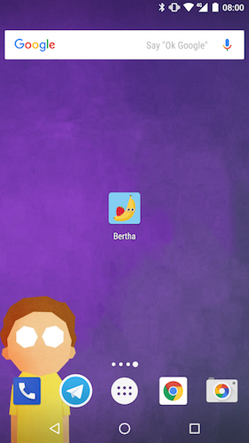
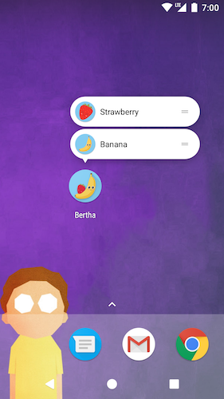
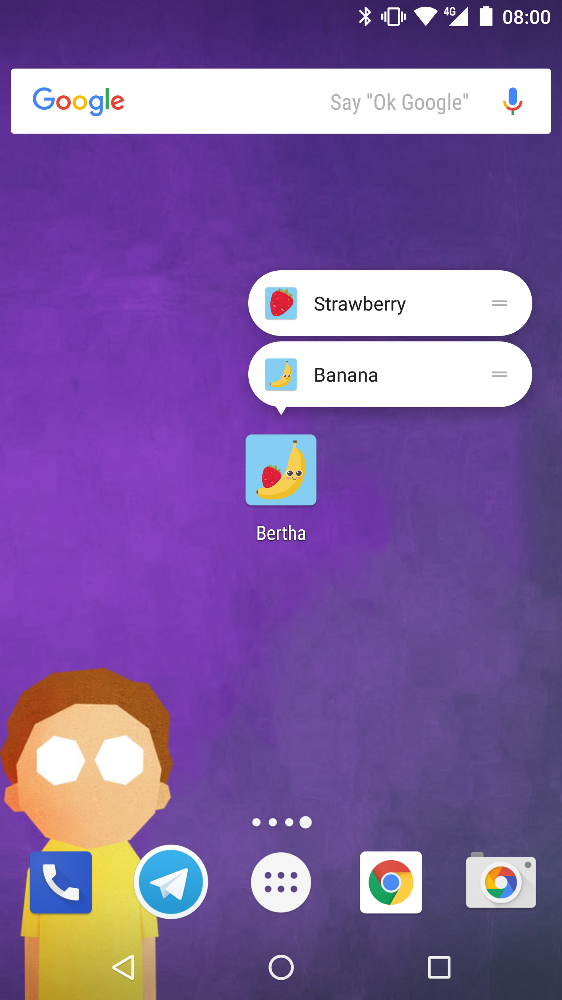

# Bertha, a launcher icon sample
Bertha is a simple demo project that showcases how to set up Android launcher icons and shortcuts, for all versions of Android up to O (8.0.0, API 26) included.

This showcases:
 * **"Legacy" launcher icons** for Android versions up to 7.0 Nougat (API 24)
    * These icons can have a background, but in this case, they don't, as most apps from that era didn't 
      (unless they had lazy designers or logos that had a background)
    * Must use PNGs as vector drawables and WEBP images were not supported for launcher icons
 * **Round launcher icons** for Android 7.1 Nougat (API 25)
    * Originally used in the Pixel launcher to have visual coherency
    * Replaced by Adaptive Icons in Android O (see next bullet point)                        
    * Must use PNGs as vector drawables and WEBP images were not supported for launcher icons
 * **Adaptive Icons** for Android 8.0 O (API 25) and later
    * Can use vector drawables (finally)
    * Different canvas size, 108dp, with a 72dp visible area
    * Safe area is actually a circle with a 72dp diameter, not a square
    * Composed of background and foreground layers, mask is provided by the launcher
    * Can be animated (but aren't yet as of Android O Developer Preview 3)
 * **Launcher shortcuts** for Android 7.1 Nougat (API 25) and later
    * Accessed via long-press or other gestures
    * Useful for deeplinks (in this case, they set the image in the app)
    * Not demoed here are dynamic shortcuts, only the static shortcuts

## Screenshots

 API < 25 | API 25 | API 26+
 --- | --- | ---
  |  | 

 API 25 | API 26+ | Demo (API 26)
 --- | --- | ---
  |  | 

## Credits and licence

The code is licenced under the Apache License 2.0, see the [LICENSE](LICENSE) file. The icons used are based on a free vector design from [Freepik](http://www.freepik.com/free-vector/fruit-background-design_1072729.htm).
